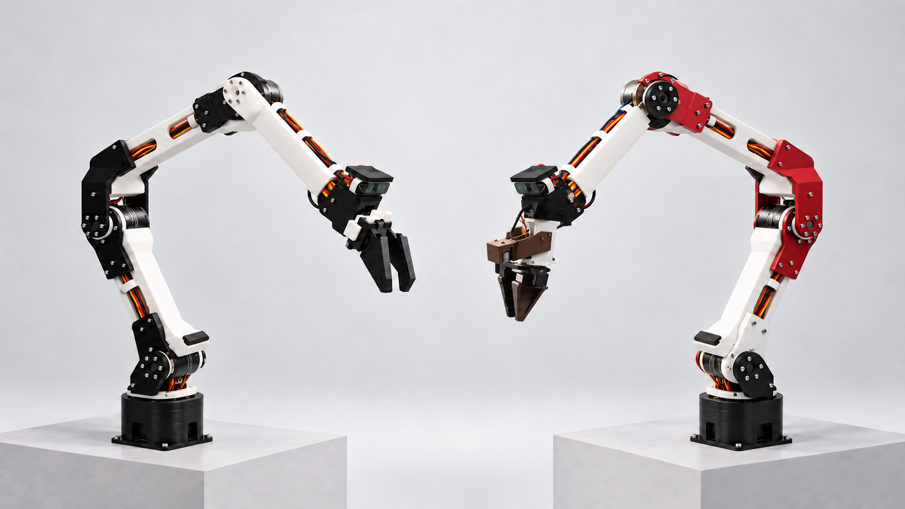

# IceCream Arm

**Dairy-Prince 的五自由度机械臂开源项目。** 仓库收录模型、Isaac Sim 仿真和 PC 控制桥接；树莓派运行端与 STM32 电机驱动仍在功能分支，尚未合入 `main`。



[快速开始](#快速开始) · [代码导航](#代码导航) · [部署路径](#部署路径) · [分支与推送](#分支与推送)

## 快速开始

从 [GitHub 仓库](https://github.com/EdieMaxie/icecream_arm) 克隆，在仓库根目录运行。仿真需要已安装的 [NVIDIA Isaac Sim](https://docs.isaacsim.omniverse.nvidia.com/)；请用其自带的 `python.sh`，并按实际安装路径替换示例。

```bash
git clone https://github.com/EdieMaxie/icecream_arm.git
cd icecream_arm
~/isaacsim/python.sh -m arm_control_bridge.run_control --sim
```

PC 桥接的参数、协议和依赖见 [中文使用说明](arm_control_bridge/README_zh.md)。先在仿真中确认关节方向、限位与通信，再连接实机。

## 代码导航

| 入口 | 内容 |
| --- | --- |
| [`arm_control_bridge/`](arm_control_bridge/README_zh.md) | PC 控制桥接、TCP/HTTP 命令、Pi UDP 下发及状态回传 |
| [`sim_code/`](sim_code/README.md) | Isaac Sim 场景、运动学与轨迹验证脚本 |
| [`icecream_model/`](icecream_model/) | ROS 包骨架、关节配置和网格模型 |
| [通信协议](arm_control_bridge/doc/) | 上层、Bridge、Pi 之间的接口说明 |

## 部署路径

1. **仿真验证**：在 PC 安装 Isaac Sim，使用上面的本地仿真命令；无需 Pi 或电机上电。
2. **PC ↔ Pi 联调**：确认所选 Pi 分支的协议、IP 和硬件配置后，在仓库根目录运行 `./arm_control_bridge/start_pc_control.sh sim <Pi_IP>`。脚本用 Isaac Sim Python 启动桥接并向 Pi 发送 UDP；桥接 TCP 默认端口 `9888`，Pi UDP 默认端口 `9870`。详见 [Bridge 使用说明](arm_control_bridge/README_zh.md)和 [Bridge → Pi 协议](arm_control_bridge/doc/bridge2pi.md)。
3. **无仿真实机运行**：完成联调和安全检查后，运行 `./arm_control_bridge/start_pc_control.sh nosim <Pi_IP>`。Pi 端部署步骤以所选 [Pi 分支](#分支与推送) 的 README 为准；Pi 端代码不在 `main`。

> 实机运行前确认急停、关节限位、坐标方向、电机映射及工作空间；仿真结果不能代替硬件安全验证。

## 分支与推送

当前远端没有 `develop` 分支。`main` 是首页和集成入口；下列分支是独立开发线，内容可能与 `main` 不同步。

| 分支 | 当前内容 |
| --- | --- |
| [`main`](https://github.com/EdieMaxie/icecream_arm/tree/main) | 模型、仿真、PC 控制桥接及本文档 |
| [`feature/head`](https://github.com/EdieMaxie/icecream_arm/tree/feature/head) | 上层 head/策略与新版桥接开发 |
| [`feature/raspberryPi-black`](https://github.com/EdieMaxie/icecream_arm/tree/feature/raspberryPi-black) | 黑色机械臂 Pi 端开发 |
| [`feature/raspberryPi-red`](https://github.com/EdieMaxie/icecream_arm/tree/feature/raspberryPi-red) | 红色机械臂 Pi 端开发 |
| [`feature/raspberryPi-server`](https://github.com/EdieMaxie/icecream_arm/tree/feature/raspberryPi-server) | Pi 服务端及接口开发 |
| [`feature/motor_driver`](https://github.com/EdieMaxie/icecream_arm/tree/feature/motor_driver) | STM32 电机驱动工程 |

**推送规则**：从最新 `main` 建立短期 `feature/*` 或 `fix/*` 分支；只提交相关源码和文档，不提交密钥、机器专属配置或临时文件；完成对应仿真/硬件自测后推送分支，经 Pull Request 合入 `main`。跨 PC、Pi、STM32 的改动须写明协议版本和联调结果；不要对共享分支强制推送。命令示例见 [Git 协作指南](git_turtorial/README.md)。

项目仍在迭代；不同分支不能仅凭分支名假定已完成跨端兼容。欢迎通过 [Issues](https://github.com/EdieMaxie/icecream_arm/issues) 反馈问题。
